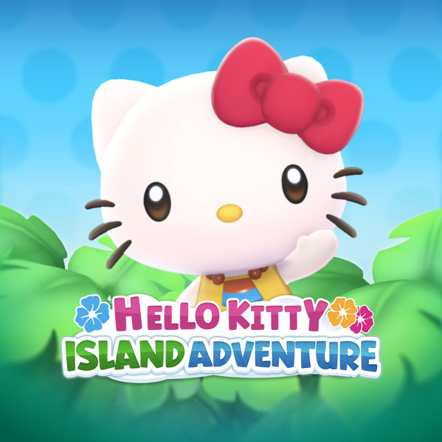
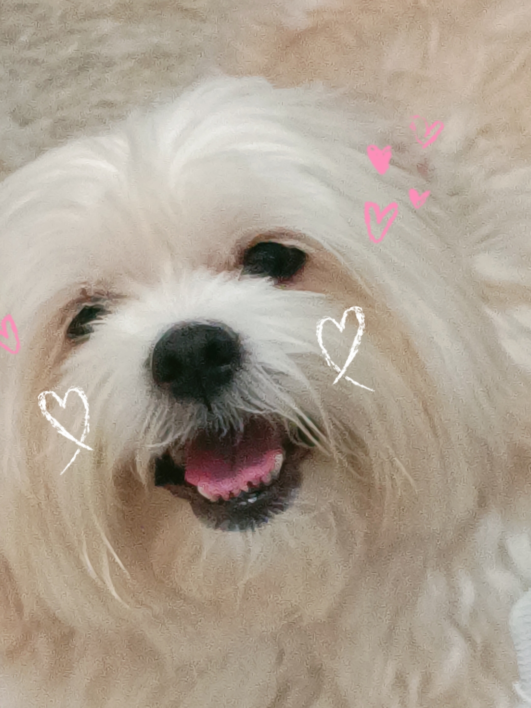
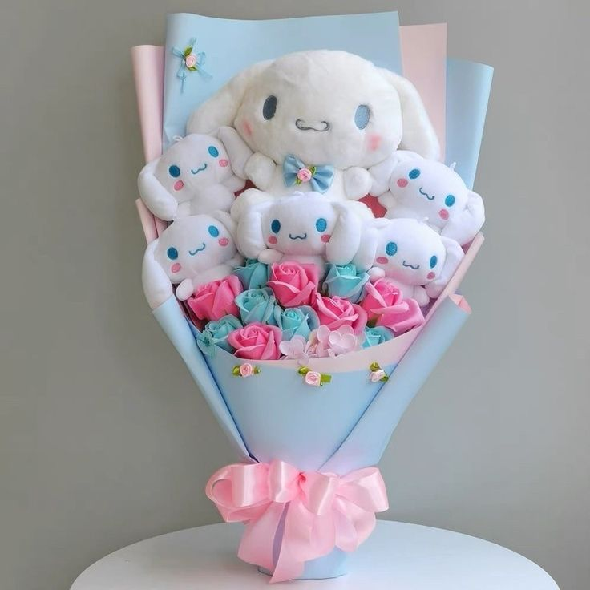
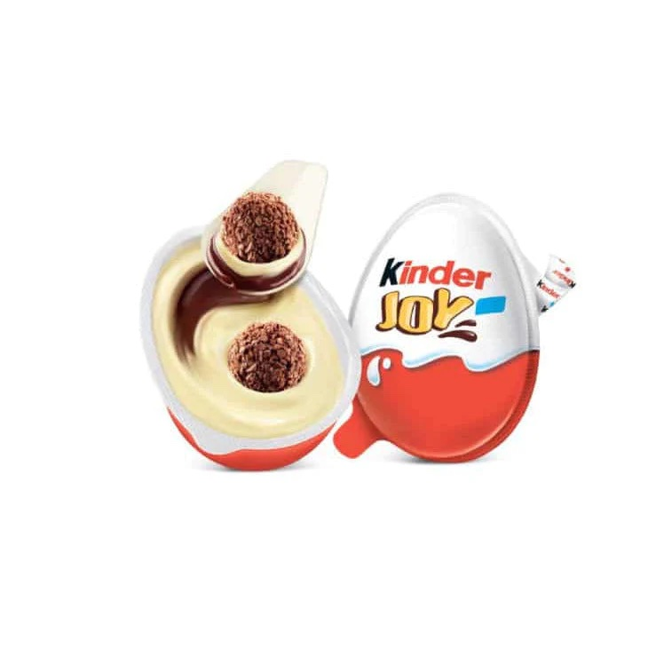

<!DOCTYPE html>
<html lang="es">
<head>
    <meta charset="UTF-8">
    <title>¿Quieres ser mi San Valentín?</title>
    
</head>
<body>
    
    
    
    
    
    

    

        <h1>¿Quieres ser mi San Valentín? 💖</h1>
        

            <button id="btnSi" onclick="aceptar()">¡Sí!</button>
            <button id="btnNo" onmouseover="moverBoton()" onclick="negar()">No</button>
        

    

    
</body>
</html>
